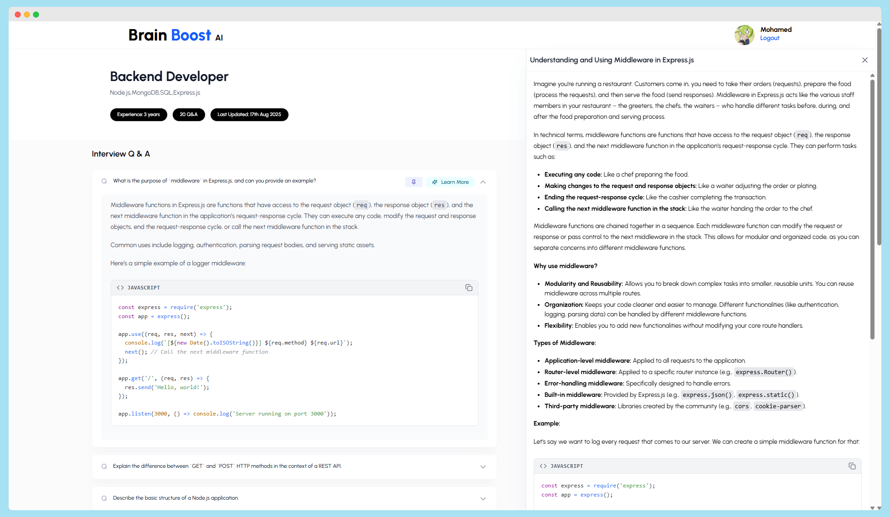

<h1 align="center" style="color:black; font-size:60px; font-weight:bold;">
  BrainBoost AI
</h1>

<p align="center">
  <!-- Tech Stack Icons with colors -->
  
  
  
  
  

</p>

<p align="center">
  
</p>

---

## 🚀 Project Overview

BrainBoost AI is an intelligent interview prep platform that generates **personalized questions and answers** based on your role and experience. Users can take notes, review topics, and explore AI-generated explanations for an efficient study flow.

---

## 🎯 Key Features

- **User Authentication** – Secure register and login using JWT.
- **Role-Based Interview Sessions** – Generate questions tailored to your job role and experience.
- **AI-Powered Q\&A** – Automatically generate high-quality technical questions and answers using the Gemini API.
- **Accordion Learning UI** – Clean, expandable Q\&A interface for focused study.
- **Dynamic AI Explanations** – On-demand concept breakdowns using AI.
- **Pin Important Questions** – Save key questions for quick access.
- **MongoDB Storage** – Persist sessions and questions for future review.
- **Responsive UI** – Modern, mobile-first design built with TailwindCSS.

---

## 🛠️ Tech Stack

| Frontend                          | Backend             | Database | AI         | Auth |
| --------------------------------- | ------------------- | -------- | ---------- | ---- |
| React, TailwindCSS, Framer Motion | Node.js, Express    | MongoDB  | Gemini API | JWT  |

---

## 🗂️ Project Structure

```
brainboost-ai/
├─ backend/         # Node.js + Express API
├─ frontend/        # React + Tailwind app
├─ README.md        # Project documentation
└─ .gitignore
```

---

## 🔧 Environment Variables

Create a `.env` file in **backend** :

**Backend (.env)**

```
GEMINI_API_KEY=your_api_key
MONGO_URI=your_mongo_connection_string
PORT=8000
```

---

## ⚡ How to Use

1. Clone the repository and install dependencies.
2. Run backend server (`npm run dev` in backend folder).
3. Run frontend (`npm start` in frontend/interview=prep=ai folder).
4. Register or login.
5. Select your role and experience level.
6. Generate AI-powered interview questions.
7. Expand answers, pin important questions, and review saved sessions.

---

## 📦 Installation

```bash
# Clone the repo
git clone https://github.com/username/brainboost-ai.git
cd brainboost-ai

# Install dependencies
cd frontend/interview-prep-ai && npm install
cd ../backend && npm install

# Start the dev servers
# Backend
cd backend && npm run dev

# Frontend
cd frontend && npm start
```

---

## 🤝 Contributing

1. Fork the repository.
2. Create a branch `feature/YourFeature`.
3. Commit your changes.
4. Open a Pull Request.

---

## 📝 License

This project is licensed under the MIT License.

---

Made with ❤️ & ⚡ by Mohamed Khaled — Science is Eleganto
